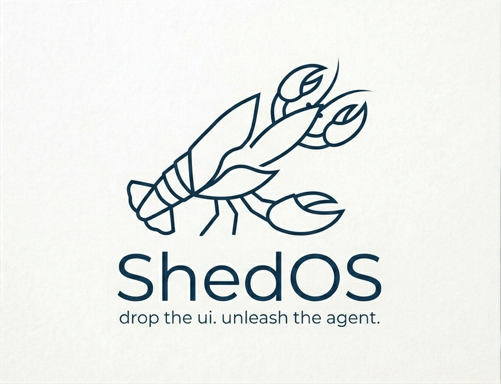

<p align="center">
  
</p>

<h1 align="center">ShedOS</h1>

<p align="center">
  A minimal Linux distro where Claude is the only user-facing process.<br>
  Boot it in VMware Fusion on Apple Silicon, walk a wizard, and from then on you
  talk to Claude — through a Chromium GUI on the Fusion window, or over SSH /
  the serial pipe.
</p>

---

## What's in it

- A graphical chat **GUI** (Chromium app-mode, on `tty1` of the VM) with tabs,
  6 themes, markdown rendering, an in-app settings panel, and **render tabs**
  for images / PDFs / web pages / syntax-highlighted code / pretty JSON.
- A minimal **chat client** (`shedos-chat.py`) for ttyS0 + SSH, in case you
  don't want the GUI — same brain, same sessions, just plain text.
- A graphical **installer wizard** (Textual under xterm) that runs on the
  first-boot Fusion window: paste your token, pick a persona, set conversation
  style, hit Install.
- A multi-session **brain daemon** the GUI + chat client both talk to over a
  Unix-socket JSON-RPC. Sessions, render tabs, and the persona/style choices
  all persist on the disk under `/var/lib/shedos/`.
- All the boring OS bits: persistent ext4 install, SSH key-only login,
  OpenRC services, atomic write patterns for everything user-persisted.

OAuth uses the Claude Code flow: `Bearer` auth, `anthropic-beta: oauth-2025-04-20`,
mandatory `"You are Claude Code..."` system prompt prefix.

## Architecture

```
host (Mac, VMware Fusion)
   ├─ vmware/shedos-system.vmdk   (16 GB, persistent)
   └─ /tmp/shedos.serial          (Unix socket pipe to guest's ttyS0)

guest (VM, Alpine 3.23 aarch64)
   tty1   ──→ Chromium --kiosk --app=http://127.0.0.1:8080/   ← the GUI
   ttyS0  ──→ shedos-chat.py                                  ← text fallback
   sshd   ──→ root shell + /usr/local/bin/shedos-chat

   shedos-brain  (daemon)  ── /run/shedos-brain.sock ── all clients
   shedos-web    (aiohttp) ── 127.0.0.1:8080  HTTP + WS bridge for the GUI

   Persistence under /var/lib/shedos/
     ├─ sessions/<uuid>.jsonl     append-only chat history (1 file per chat tab)
     ├─ render/<asset>/<file>     staged images/PDFs/HTML for render_* tools
     └─ render-tabs.json          open render tabs (replayed on page refresh)
```

Disk layout on `/dev/sda` (16 GB total):

| Partition | Size      | FS    | Mount     |
|-----------|-----------|-------|-----------|
| sda1 ESP  | 256 MiB   | FAT32 | /boot/efi |
| sda2 root | 4 GiB     | ext4  | /         |
| sda3 home | ~11.7 GiB | ext4  | /home     |

## Requirements (host)

- macOS on Apple Silicon (Alpine arm64 + Fusion arm64 VM)
- VMware Fusion 13+
- A Claude Code OAuth token. Get one with `claude setup-token` on any machine
  with Claude Code installed. Starts with `sk-ant-oat01-`.
- An SSH keypair at `~/.ssh/id_ed25519` (or `id_rsa`, or `id_ecdsa`) — gets
  baked into the installer ISO for `make ssh` after install.
- `brew install xorriso socat python@3` — xorriso builds the ISO,
  socat handles the host raw-mode + colors over the serial pipe for
  `make tui`. macOS ships its own `/usr/bin/python3` so the brew
  install is belt-and-suspenders (build.sh checks for `python3` at
  startup; if you're on a stripped install without it, the brew
  install is what makes the check pass).

## Build & install

```bash
export CLAUDE_CODE_OAUTH_TOKEN='sk-ant-oat01-...'
make iso               # builds out/shedos-installer.iso + a 16 GB vmware/shedos-system.vmdk
make run               # boots the VM in Fusion; first boot runs the wizard + installer
```

Skipping the token export still works — the wizard prompts for one (and you
can also paste with Cmd+V into the Fusion window, since the wizard runs
under X with VMware Tools clipboard bridging).

First install takes ~5–10 min (apk fetches a few hundred MB from the Alpine
CDN). After the post-install reboot, normal boots are ~5–10 seconds.

## Talking to it

Two interfaces, same brain:

```bash
# 1. The GUI — usually what you want
#    Just look at the Fusion window. Chromium opens automatically in app mode.

# 2. Text fallback (useful for headless or SSH-only sessions)
make tui      # connect to shedos-chat.py over the serial pipe (needs `brew install socat`)
make ssh      # SSH into the VM; then run `shedos-chat` from any directory
make console  # raw `nc -U` over the serial pipe — debug-only; ttyS0 hosts shedos-chat
              # which needs a PTY, so `make tui` is the right user-facing version
```

**GUI features:** click `+` for a new chat tab, click `⚙` for settings
(theme picker, persona dropdown, style toggles). Type `Cmd+V` to paste, links
in Claude's responses open in new tabs, ⌘+W closes the focused tab. The
brain can also open special tabs for content via `render_*` tools — images
(zoom), PDFs (Chromium's viewer), web pages (sandboxed iframe), formatted
markdown, syntax-highlighted code, and pretty-printed JSON.

**Chat-client commands:**

```
/help              show available commands
/new [title]       create + switch to a new session
/list              list sessions, most-recent first
/switch <n|id>     switch by index from /list or by full id
/title <text>      rename current session
/delete <n|id>     delete a session
/clear             clear screen
/quit              exit (Ctrl-D also works)
```

## Tools available to the brain

| tool                       | purpose                                            |
|----------------------------|----------------------------------------------------|
| `bash`                     | run a shell command as root                        |
| `apk`                      | Alpine package manager                             |
| `read_file`, `write_file`  | filesystem                                         |
| `list_dir`                 | directory listing                                  |
| `process_list`, `process_kill` | process control                                |
| `net_fetch`                | HTTP GET (cap'd response size, base64 fallback)    |
| `render_image`             | open an image in a new GUI tab                     |
| `render_pdf`               | open a PDF in a new GUI tab                        |
| `render_web`               | open a URL in a sandboxed iframe tab               |
| `render_markdown`          | render markdown as a styled GUI tab                |
| `render_code`              | syntax-highlight code (Pygments) in a tab          |
| `render_json`              | pretty-print JSON in a tab                         |

All `render_*` tools also work when you're using the chat client (the
`shedos-chat.py` UI prints a `→ opened <type> tab: <title>` line so you
know to flip to the GUI window, or `ssh` and `curl http://127.0.0.1:8080/...`).

## SSH escape hatch

```bash
make ip     # print the VM's NAT IP
make ssh    # ssh root@<vm-ip>
```

Key-only login as root. Useful for `apk upgrade`, file recovery, or just
poking around when the brain is doing something unexpected.

## Iterating without rebuilding the ISO

```bash
# Brain Python code:
scp overlay/opt/shedos/brain.py root@<vm-ip>:/opt/shedos/brain.py
ssh root@<vm-ip> 'rc-service shedos-brain restart'

# Frontend (HTML / CSS / JS — no service restart, just Cmd+R in the GUI):
scp overlay/opt/shedos/web/* root@<vm-ip>:/opt/shedos/web/

# Web bridge:
scp overlay/opt/shedos/web_server.py root@<vm-ip>:/opt/shedos/
ssh root@<vm-ip> 'rc-service shedos-web restart'
```

For deeper changes (new packages, new services, schema changes), rebuild
the ISO + `make wipe-system && make run` to reinstall fresh.

## Repo layout

```
shedos/
├── README.md, LICENSE, CLAUDE.md
├── Makefile               iso, run, tui, ssh, ip, wipe-system, …
├── build.sh               build pipeline
├── config/
│   ├── alpine-release     "3.23.0"
│   ├── arch               "aarch64"
│   ├── version            single source of truth for ShedOS version
│   └── target-packages.list   apk packages installed onto the target
├── installer/             apkovl baked into the live installer ISO
│   ├── etc/inittab        tty1 runs wizard.py, ttyS0 is a debug getty
│   ├── etc/apk/world      live-system packages (parted, python3, py3-rich, ...)
│   └── opt/shedos-installer/{wizard.py,installer.sh,run-installer.sh}
├── overlay/               extracted onto the target system during install
│   ├── etc/inittab        tty1 → run-gui.sh, ttyS0 → run-chat.sh
│   ├── etc/init.d/{shedos-brain,shedos-web}   OpenRC services
│   ├── etc/shedos/personas/  4 persona presets (default/coding/sysadmin/researcher)
│   ├── opt/shedos/
│   │   ├── brain.py, rpc_server.py, sessions.py, web_server.py
│   │   ├── tools.py, anthropic_client.py, config.py, brain_client.py
│   │   ├── shedos-chat.py, run-chat.sh, run-gui.sh
│   │   └── web/           SPA frontend (index.html + app.js + style.css)
│   ├── root/.xinitrc      openbox + Chromium respawn loop
│   └── usr/local/bin/shedos-chat  → /opt/shedos/run-chat.sh
├── vmware/                .vmx template + launch.sh (Fusion VM config)
├── docs/                  README assets (logo, screenshots, …)
├── .github/
│   ├── workflows/claude-review.yml   PR-review action driven by Claude
│   └── CODE_REVIEW.md     standards Claude follows during PR reviews
└── out/                   (gitignored) shedos-installer.iso
```

## Threat model — read this

ShedOS is a **single-user appliance**. The `bash` tool runs as root with no
sandboxing. Anyone with the OAuth token has full root inside the VM, and
anyone who can prompt-inject the agent through the natural-language interface
has the same. Don't:

- Boot this ISO on a hostile network.
- Hand the ISO or the system VMDK to someone else — both have *your* OAuth
  token and *your* SSH public key baked in.
- Mount sensitive host volumes into the VM.

Do:

- If you suspect the token leaked, revoke it from the Anthropic console.
- `make wipe-system` to nuke the persistent disk and start fresh (the next
  `make run` will reinstall from scratch).

## Troubleshooting

**The VM boots into the installer every time.** UEFI found no bootloader on
`/dev/sda` — the previous install failed mid-way, or the disk was wiped.
Re-running the installer should fix it. Check the wizard output in the
Fusion window or `make console` for the underlying error.

**Wizard says `python3 not found`.** The live ISO is still doing its
first-boot `apk add`. Wait ~30s and it'll appear.

**Wizard renders garbled / no input.** Most often: the Fusion window
doesn't have keyboard focus — click into it. If the Textual UI itself
is the problem, `wizard.py` already falls back to a line-by-line
`rich` UI automatically *when* `textual` can't be imported (e.g. the
live ISO's `pip install textual` step failed because of no network).
You don't need to do anything to trigger that. If you want to bail
and re-run from scratch, press `Esc` in the wizard — it reboots back
to a fresh attempt.

**`make tui` shows nothing after install completes.** Brain hasn't started
yet. Give it 5–15 seconds after the post-install boot. If still empty,
SSH in and check `ps -ef | grep brain` and `tail /var/log/messages`.

**Chromium window in the Fusion VM stays blank after install.** The GUI
loads `http://127.0.0.1:8080/` so it needs both `shedos-web` (the
aiohttp bridge) and `shedos-brain` running. `make ssh` in, then
`rc-status` should show both as `started`. If one is `crashed` or
`stopped`, `rc-service shedos-brain restart` and `rc-service shedos-web
restart` (OpenRC already encodes the dependency, so the order rarely
matters). If the GUI keeps flashing back to a terminal,
`tail /var/log/messages` plus `tail /var/log/shedos-{brain,web}.log`
usually points at it (most common: missing or invalid
`/etc/shedos/token`).

**Brain returns "credit balance is too low".** Misleading OAuth error.
Check (1) token is fresh — re-run `claude setup-token`, (2) the system
prompt prefix is intact in `anthropic_client.py`, (3) the
`anthropic-beta: oauth-2025-04-20` header is unchanged.

**Fusion error: "No PCIe slot available for Ethernet0".** The PCIe
root-port bridges aren't in `.vmx`. They're in the template — make sure
the rendered `vmware/shedos.vmx` has the `pciBridge4..7` lines.

**Cmd+V into the wizard doesn't paste.** `open-vm-tools-gtk`'s
`vmware-user` should bridge Fusion's clipboard into X — make sure
`vmtoolsd` is running (`ps aux | grep vmtools` in another tty).
If it's not, skip the token in the wizard and write `/etc/shedos/token`
from `make ssh` after install.

## License

[MIT](LICENSE) — Felipe Simoes, 2026.
